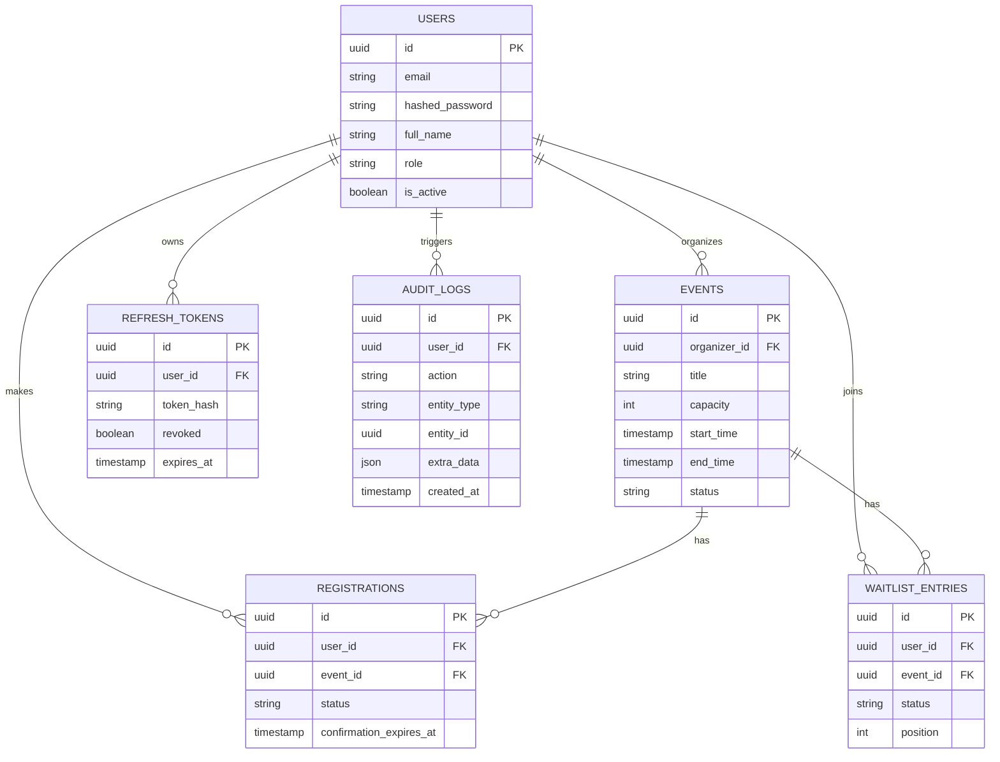

# Event Booking API

A backend API for managing tech events and workshops with limited capacity, built as a learning project to apply backend concepts (FastAPI, async SQLAlchemy, JWT auth, PostgreSQL) in something more realistic than a basic CRUD app.

The main thing I wanted to practice was handling registration capacity correctly when multiple users try to grab the same spot at the same time, plus a full approval workflow and an automatic waitlist system.

## Tech Stack

- **Python** / **FastAPI**
- **PostgreSQL** with **SQLAlchemy 2.0** 
- **Alembic** for migrations
- **Pydantic v2** for validation
- **PyJWT** + **Passlib (bcrypt)** for authentication
- **slowapi** for rate limiting
- **pytest** + **pytest-asyncio** + **httpx** for testing

## Features

- JWT authentication with access + refresh tokens (rotation on refresh, revocation on logout)
- Role-based access control: `attendee`, `organizer`, `admin`
- Events go through an approval flow before becoming public: `draft → pending_approval → approved/rejected`
- Registration with capacity-safe handling — concurrent registration requests on a full event are handled correctly using row-level locking
- Automatic waitlist promotion when someone cancels, with a time-limited confirmation window
- Events past their `end_time` are automatically closed, and any dangling pending registrations/waitlist entries are expired
- Audit logging middleware for write operations
- Rate limiting on login and registration endpoints

## Entity-Relationship Diagram



## Roles

| Role | Can do |
|---|---|
| `attendee` | Register for events, join waitlists, manage own registrations |
| `organizer` | Create and manage own events |
| `admin` | Approve/reject events, manage users |

## API Endpoints

| Method | Endpoint | Access |
|---|---|---|
| POST | `/auth/register` | Public |
| POST | `/auth/login` | Public |
| POST | `/auth/refresh` | Public |
| POST | `/auth/logout` | Public |
| GET / PATCH | `/users/me` | Authenticated |
| GET | `/users`<br>`/users/{id}` | Admin |
| PATCH | `/users/{id}` | Admin |
| POST | `/events` | Organizer / Admin |
| POST | `/events/{id}/submit` | Owner / Admin |
| GET | `/events`<br>`/events/{id}` | Public |
| GET | `/events/pending` | Admin |
| PATCH | `/events/{id}` | Owner / Admin |
| POST | `/events/{id}/review` | Admin |
| POST | `/events/{id}/cancel` | Owner / Admin |
| POST | `/registrations` | Authenticated |
| POST | `/registrations/{id}/confirm`<br>`/registrations/{id}/cancel` | Owner |
| GET | `/registrations/me` | Authenticated |
| GET | `/events/{id}/registrations` | Owner / Admin |
| GET | `/waitlist/me`<br>`/events/{id}/waitlist` | Authenticated / Owner / Admin |

Full docs at `/docs` once running.

## Testing

```bash
# create a separate test database first (see .env.example for TEST_DATABASE_URL)
pytest -v
```

Covers auth, user management, event validation/approval workflow, registration/waitlist flows, and one concurrency test for the capacity locking.

## Known Limitations

- **Asynchronous Task Processing:** The automatic expiration sweep currently runs during the request lifecycle. For massive datasets, offloading this cleanup task to a background worker (e.g., Celery/Redis) would prevent database table locking and maintain sub-millisecond API latency.
- **Dynamic Waitlist Recalculation:** Waitlist `position` is currently static upon entry to minimize heavy database write operations. A future iteration would implement a read-optimized view or event-driven updates to reflect real-time queue changes efficiently.
- **Admin API Pagination:** As the user and registration tables grow, administrative list endpoints (like `/events/{id}/registrations`) will transition to cursor-based or offset pagination to maintain optimal JSON payload sizes and prevent server memory overload.
- **Attendance State Machine:** Expanding the registration lifecycle to include a physical "Checked-in" status (e.g., via QR scanning at the door), separating the digital "Confirmed" ticket from actual physical attendance.


## Getting Started

```bash
git clone https://github.com/<your-username>/event-booking-api.git
cd event-booking-api
python -m venv venv
source venv/bin/activate  # venv\Scripts\activate on Windows
pip install -r requirements.txt
cp .env.example .env  # fill in your values
alembic upgrade head
uvicorn app.main:app --reload
```

## License

MIT